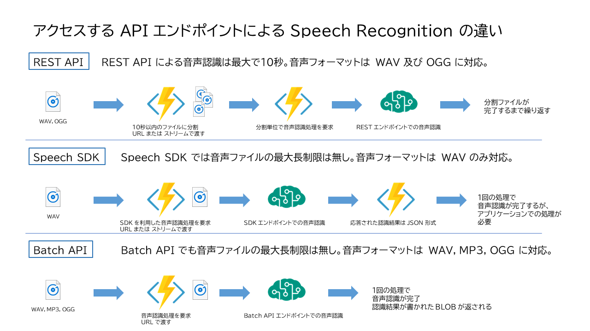

# Batch Transcripter

## 概要
Batch Transcripter は**音声ファイルから「なるべく簡単に」文字を起こす**仕組みです。
通常 Cognitive Services の Speech Service をはじめとする音声認識システムは API のみの提供であり、例えば簡単に議事録の音声を文字化するとしてもアプリケーションを作成する必要があり、一般的なオフィス用途で使用しようとしても非常にハードルが高いものでした。

そこでこのシステムではなるべくコードを書かずに、且つ使いやすく、追加のコードも無しに音声ファイルから自動的にテキストを出力する仕組みとしました。特徴は以下の通りです。

- **Azure Logic Apps** を使用し、**ほとんどの処理を GUI のみで作成**
- **Cognitive Services Speech Services** を使うことで、**多数の言語において高精度な音声認識**を実現 (最先端の MSR の音声認識技術がベース)
- Speech Service **Batch Transcription** を使用することで、**無制限の長さの音声ファイルに対応**（仕様は非公開）
- 通常の音声認識に必要な無音区間検出や短時間での音声ファイルの切り出しは自動で行われるため不要

今回の仕組みでは Blob Storage または OneDrive for Business で仕組みを作成していますが、Logic Apps のトリガーに設定できるものであれば**どんなストレージでも対応可能**です。

## 制限

- 音声ファイルは WAV、MP3、OGG の3種類のみ対応（Apple AAC には非対応ですので、iOS を利用する際にはご注意ください）
- ビットレートは 16bit 、サンプルレートは 8 または 16 KHz 、モノラルまたはステレオに対応（ステレオ音源の場合には channel 0 及び 1 にそれぞれ認識結果が格納されます）
- 現在のバッチ文字起こしの「開始時間」はベストエフォートで設定されます。従って非常に短時間のファイルであっても、10分経過しないと文字起こしが開始しない可能性があります（開始後は通常の文字起こしよりも高速に処理されます）

最新の制限事項などは以下の URL をご覧ください。

[Batch 文字起こしを使用する理由](https://docs.microsoft.com/ja-jp/azure/cognitive-services/speech-service/batch-transcription)

## 仕組み
Logic Apps にコードを展開後にフローを見ると分かりやすいのですが、

1. ストレージに新規のファイルが投入されるとトリガー発動
2. (OneDrive の場合) 音声ファイルに共有リンクを作成
3. 上記リンクを使用して音声認識タスクの作成を要求
4. 音声認識状況の確認（開始され、文字起こしが行われるまでループ処理）
5. 音声認識結果を取得し、文字列に変換
6. 結果格納用のストレージに上記文字列ファイルを格納
7. 音声認識タスクおよびオリジナルの音声ファイルを削除

という流れで実行されます。
Blob と OneDrive for Business の二つの違いは、

- OneDrive for Business は Windows Explorer 等で簡単にファイルの共有が可能であり、Web 画面で利用する場合には特別なソフトウェアも不要
- BLOB は SAS (Shared Access Signature) によるフォルダ共有が可能なため、外部への公開やアプリケーションとの親和性が高い

という点があるので、それぞれご自身のご利用したいシチュエーションに合わせてご利用頂くことが可能です。

## 使い方

- [OneDrive for Business 版](usageODB.md)
- [Azure Storage BLOB 版](usageBlob.md)

## TODO
- 途中失敗時の認識タスクIDの削除（どこで？）
- 開始時間のコントロールができないとしても、Estimate はできないのか？？

## Notice
本プログラムは無保証です。ご利用者の責任の範囲でご利用ください。本プログラムを使用したいかなる損害につきましても補償致しません。
ライセンスはMITライセンスに準拠します。