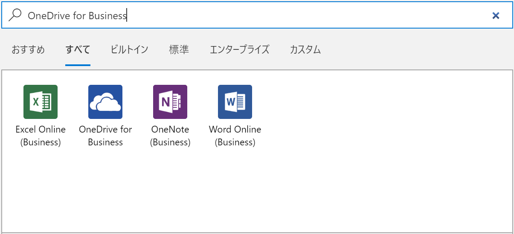
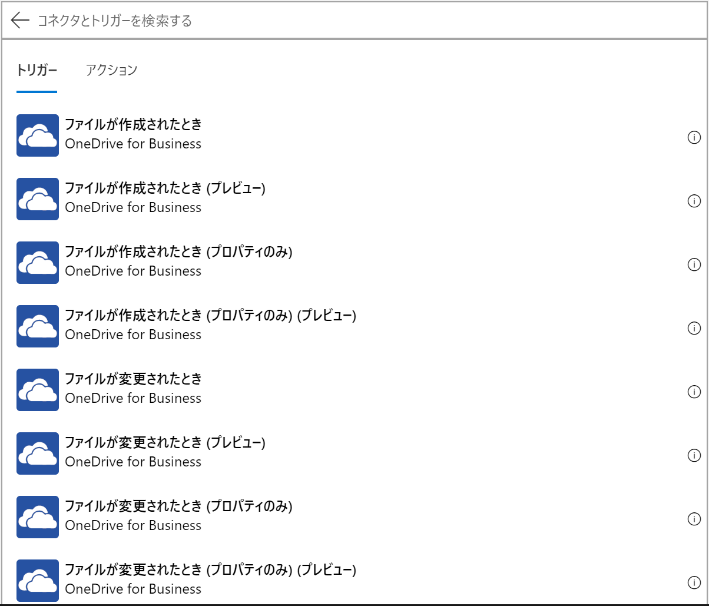
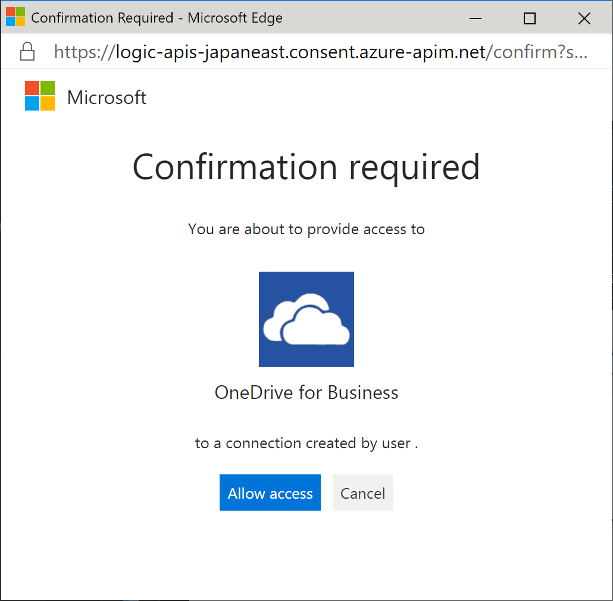
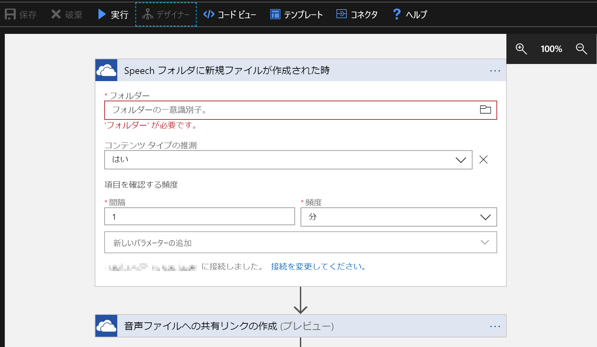
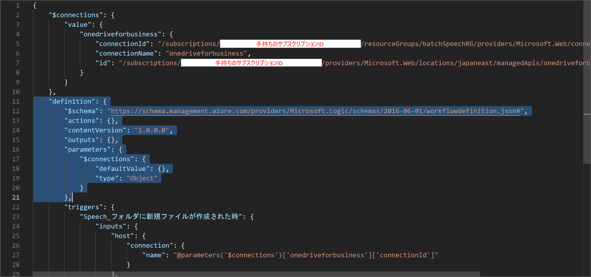
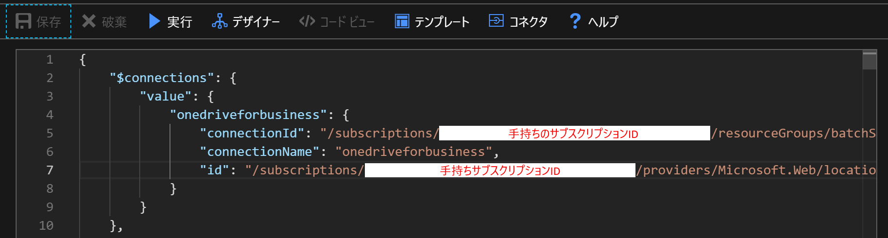
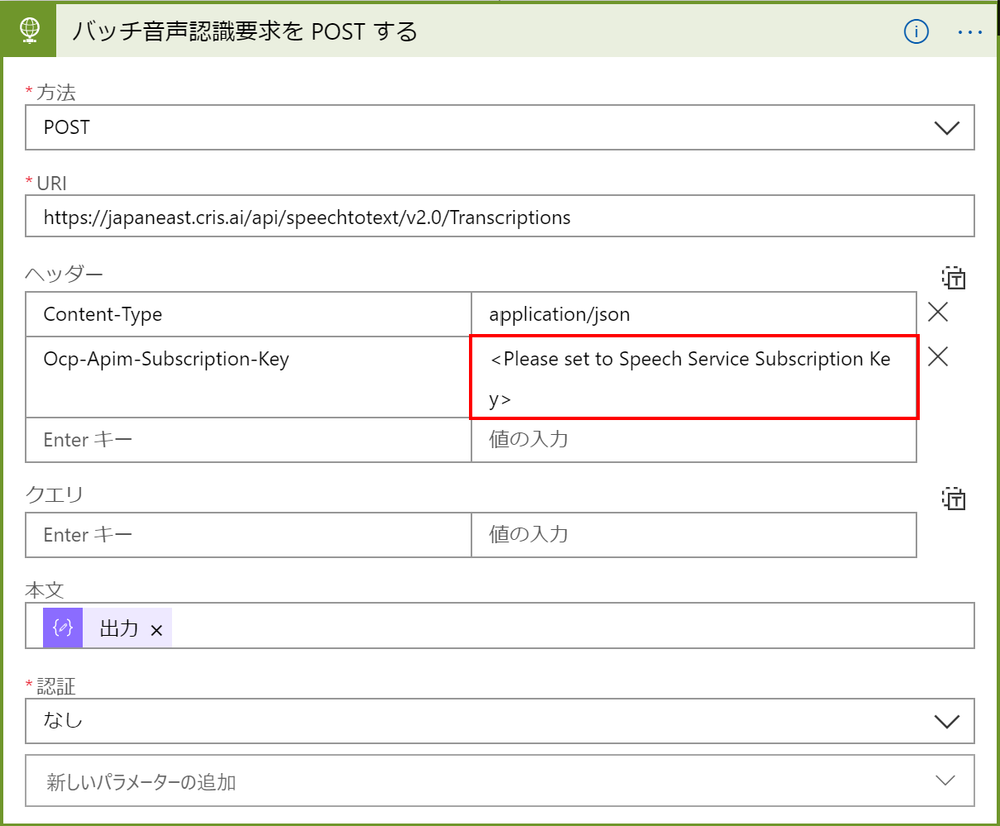
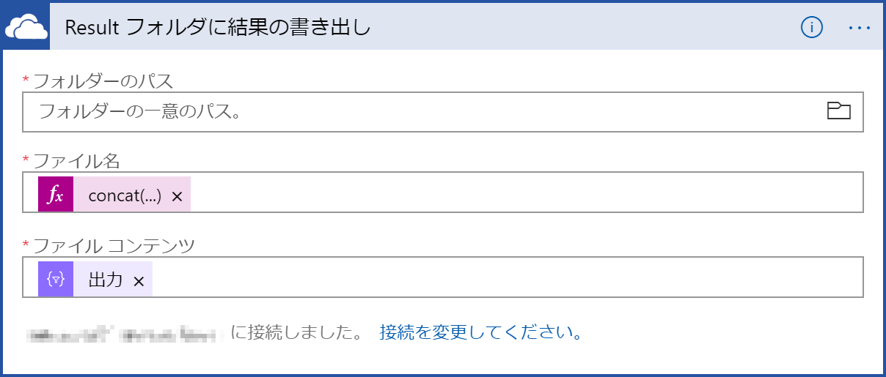
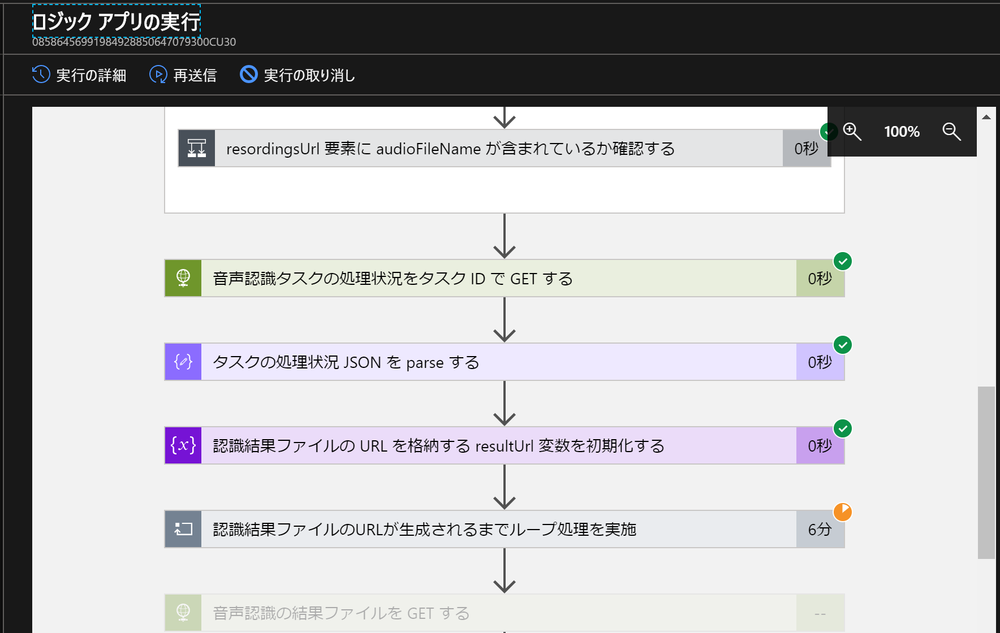

# Batch Transcripter

## 概要
Batch Transcripter は音声ファイルから「なるべく簡単に」文字を起こす仕組みです。
通常 Cognitive Services の Speech Service をはじめとする音声認識システムは API のみの提供であり、例えば簡単に議事録の音声を文字化するとしてもアプリケーションを作成する必要があり、一般的なオフィス用途で使用しようとしても非常にハードルが高いものでした。

そこでこのシステムではなるべくコードを書かずに、且つ使いやすく、追加のコードも無しに音声ファイルから自動的にテキストを出力する仕組みとしました。特徴は以下の通りです。

- Azure Logic Apps を使用し、ほとんどの処理を GUI のみで作成
- Cognitive Services Speech Service を使うことで、高精度な音声認識を実現 (最先端の MSR の音声認識技術がベース)
- Speech Service Batch Transcription を使用することで、無制限（仕様は非公開）の長さの音声ファイルに対応
- 通常の音声認識に必要な無音区間検出や短時間での音声ファイルの切り出しは自動で行われるため不要

今回の仕組みでは Blob Storage または OneDrive for Business で仕組みを作成していますが、Logic Apps のトリガーに設定できるものであればどんなストレージでも対応可能です。

## 制限

- 音声ファイルは WAV、MP3、OGG の3種類のみ対応（Apple AAC には非対応ですので、iOS を利用する際にはご注意ください）
- ビットレートは 16bit 、サンプルレートは 8 または 16 KHz 、モノラルまたはステレオに対応（ステレオ音源の場合には channel 0 及び 1 にそれぞれ認識結果が格納されます）
- 現在のバッチ文字起こしの「開始時間」はベストエフォートで設定されます。従って非常に短時間のファイルであっても、10分経過しないと文字起こしが開始しない可能性があります（開始後は通常の文字起こしよりも高速に処理されます）

最新の制限事項などは以下の URL をご覧ください。

[Batch 文字起こしを使用する理由](https://docs.microsoft.com/ja-jp/azure/cognitive-services/speech-service/batch-transcription)

## 仕組み
Logic Apps にコードを展開後にフローを見ると分かりやすいのですが、

1. ストレージに新規のファイルが投入されるとトリガー発動
2. (OneDrive の場合) 音声ファイルに共有リンクを作成
3. 上記リンクを使用して音声認識タスクの作成を要求
4. 音声認識状況の確認（開始され、文字起こしが行われるまでループ処理）
5. 音声認識結果を取得し、文字列に変換
6. 結果格納用のストレージに上記文字列ファイルを格納
7. 音声認識タスクおよびオリジナルの音声ファイルを削除

という流れで実行されます。
Blob と OneDrive for Business の二つの違いは、

- OneDrive for Business は Windows Explorer 等で簡単にファイルの共有が可能であり、Web 画面で利用する場合には特別なソフトウェアも不要
- BLOB は SAS (Shared Access Signature) によるフォルダ共有が可能なため、外部への公開やアプリケーションとの親和性が高い

という点があるので、それぞれご自身のご利用したいシチュエーションに合わせてご利用頂くことが可能です。

## 使い方（OneDrive for Business 版）

1. Azure Portal から Logic Apps を作成します。
   
   

   

   

2. デプロイされた Logic Apps リソースを開き、「空のロジック アプリ」を作成します。
   
   

   

3. 「ロジック アプリ デザイナー」が開くので「コネクタとトリガーを検索する」欄で「OneDrive for Business」と入力し、検索結果から「OneDrive for Business」を選択します。
   
   

4. トリガーの検索結果から「ファイルが作成されたとき」を選択します（プレビュー版はサブディレクトリの再帰検索が可能です）。
   
   

5. API接続情報は自動的に作成されないため、以下の画面で「サインイン」をクリックし、API 接続を作成します。
   
   

6. 認証画面がポップアップ表示されるので、必要なユーザーで認証を行います。
   
   

7. 更に OneDrive for Business での認証を許可します。
   
   

8. トリガーが作成されるため、名前を「Speech フォルダに新規ファイルが作成された時」にし、OneDrive for Business のフォルダから文字起こしをしたいフォルダを指定します。「間隔」は実際にチェックを行いたい時間の間隔を指定します。
   
    

9.  「保存」をクリックし、一旦内容を保存した後、「コードビュー」をクリックします。
    
   

10. 開いたコードの「definition」とサブアイテムの「$schema」から「parameters」の内容を選択し、BatchTranscriptforOneDriveBiz.json のファイルの内容で全て上書きコピーします（triggers は消さないように注意してください）。
    
   

11. 変更後、「保存」をクリックします。その後「デザイナー」ボタンをクリックし、デザイナー画面を開きます。
    
   

12. 次に「バッチ音声認識要求を POST する」を開き、「Ocp-Apim-Subscription-Key」の右のカラムに Speech Services のサブスクリプション キーを入力します（サービス未作成の場合は別途作成してください）。このシステムでは REST の呼び出し先が「japaneast（東日本）」となっていますので、東日本でサービスを作成するか、適宜変更を行ってください。
    
    

13. 以下のアクションについても同様に変更を行います。
    
    

    

    

    

14. 結果のテキストファイルを配置する OneDrive for Business のフォルダを指定します。
    
    

15. 最後に「実行」ボタンを押し、トリガーを実行します（この時点では何も動きません）。
    
16. 8項で指定した OneDrive for Business フォルダに音声ファイルを配置します。ここでは例として Explorer に統合された OneDrive にファイルを配置していますが、Web で直接置いても問題ありません。
    
    

17. Logic Apps の「概要」をクリックし、「実行の履歴」に音声認識処理が追加されるのを待ちます（ローカルのOneDrive for Business のフォルダに配置した場合、処理開始まで数分掛かることがあります）。
    
    

18. 追加された処理をクリックすると、現在の実行状況が表示されます。最後の処理が完了するまで待機します。
    
    

19. 全ての処理が完了後、元の音声ファイルが削除され、元のファイル名+.txt ファイルの音声認識結果ファイルが作成されていれば完了です。
    
    

    

    

## TODO
- BLOB 編の手順作成 (Soon!)
- 途中失敗時の認識タスクIDの削除（どこで？）
- 開始時間のコントロールができないとしても、Estimate はできないのか？？

## Notice
本プログラムは無保証です。ご利用者の責任の範囲でご利用ください。本プログラムを使用したいかなる損害につきましても補償致しません。
ライセンスはMITライセンスに準拠します。