## 使い方（Azure Storage BLOB Blob Trigger 版）

1. 途中の手順までは Azure Storage BLOB Event Hub Trigger 版のとおりに進めます。まだ未作業の場合には[こちら](usageBlobEH.md)の手順を進めてください。
   
2. トリガーの検索ウィンドウで「blob」と入力し、検索結果から「BLOB が追加または変更されたとき（プロパティのみ） (プレビュー)」を選択します。
    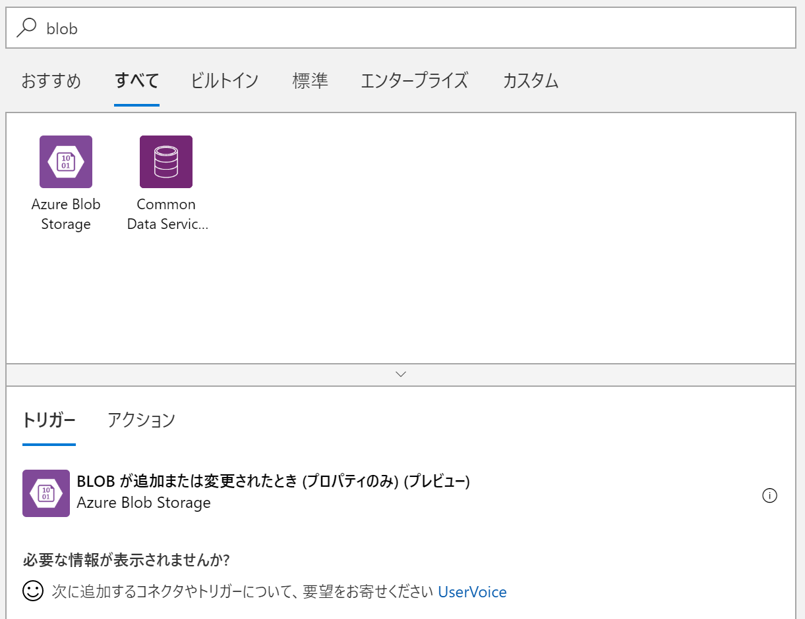

3. 初めて BLOB に接続する場合には接続する BLOB の選択画面が表示されますので、接続したい BLOB を選択し、「作成」をクリックします。「接続名」は任意なのですが、後続作業でペーストするコードでの記述が「azureblob」となっているので、ここではそのように名前を付けます。他の名前に変更する場合には、後続の作業で適宜変更を行ってください。
    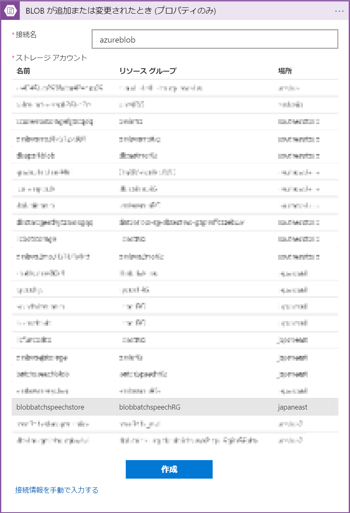

4. 接続設定が完了後、音源を配置するコンテナ名を設定します。「トリガーから返される BLOB の数」を「1」に設定し、「間隔」を任意の間隔で設定します。ここではテストのために「10秒」で設定します。
    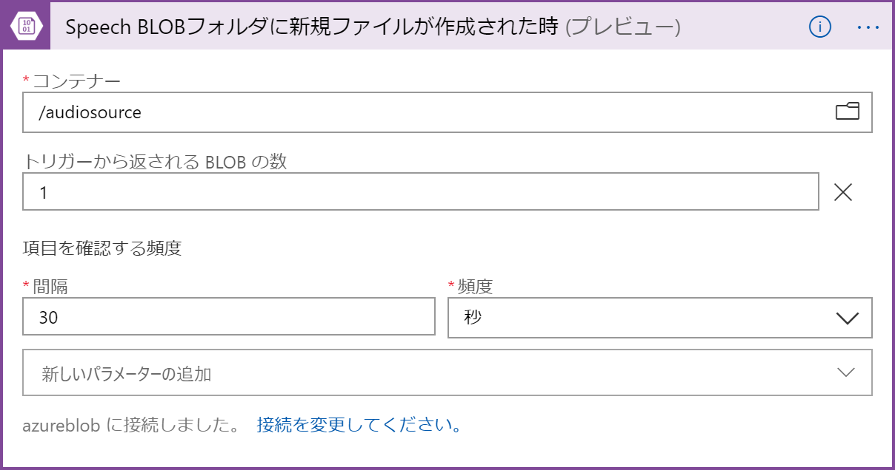

5. 「保存」をクリックし、一旦内容を保存した後、「コードビュー」をクリックします。
    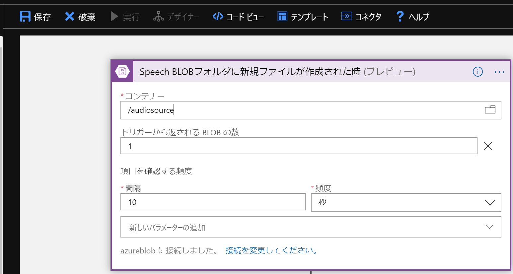

6.  開いたコードの `definition` のサブアイテム `$schema`から `parameters` まで(triggersの直前まで)の内容を選択し、[BatchTranscriptforBlob.json](BatchTranscriptforBlob.json) のファイルの内容で全て上書きコピーします（triggers は消さないように注意してください）。カスタムモデルを使用した認識を行う場合には [BatchTranscriptforBlobCust.json](BatchTranscriptforBlobCust.json) を使用します。
    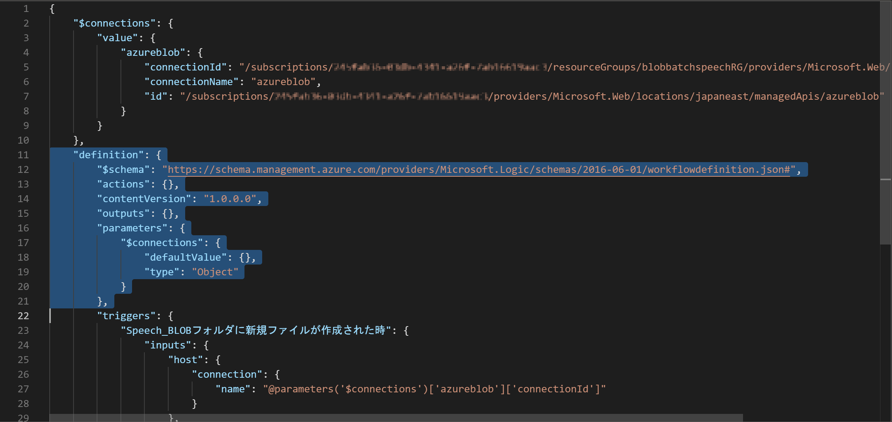

7.  変更後、「保存」をクリックします。その後「デザイナー」ボタンをクリックし、デザイナー画面を開きます。
    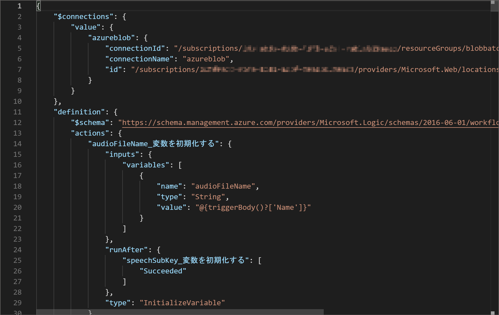

8.  次に「speechSubKey 変数を初期化する」を開き、「値」の欄に Speech Services のサブスクリプション キーを入力します（サービス未作成の場合は別途作成してください）。このシステムでは REST の呼び出し先が「japaneast（東日本）」となっていますので、東日本でサービスを作成するか、Speech Services を呼び出す箇所のURLの変更を行ってください。
    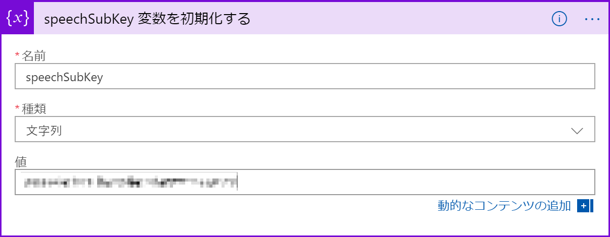

9.  次に「バッチ音声認識用 JSON の作成」を開き、「recordingUrl」のプロパティの変更を行います。"https://<Blob Host Name>.blob.core.windows.net@{triggerBody()?['Path']}?<Blob SAS Parameters>" と なっている箇所を、例えば blobstore という名前のストレージアカウントで作成した場合には「blobstore.blob.core.windows.net」と、「?」以降の部分はAzure Storage BLOB Event Hub Trigger 版の8で保存したSASキーURLの「?」以降の部分で置き換えます。
カスタムモデルを使用する場合には models の箇所を作成した言語モデルのIDに置き換えます。
     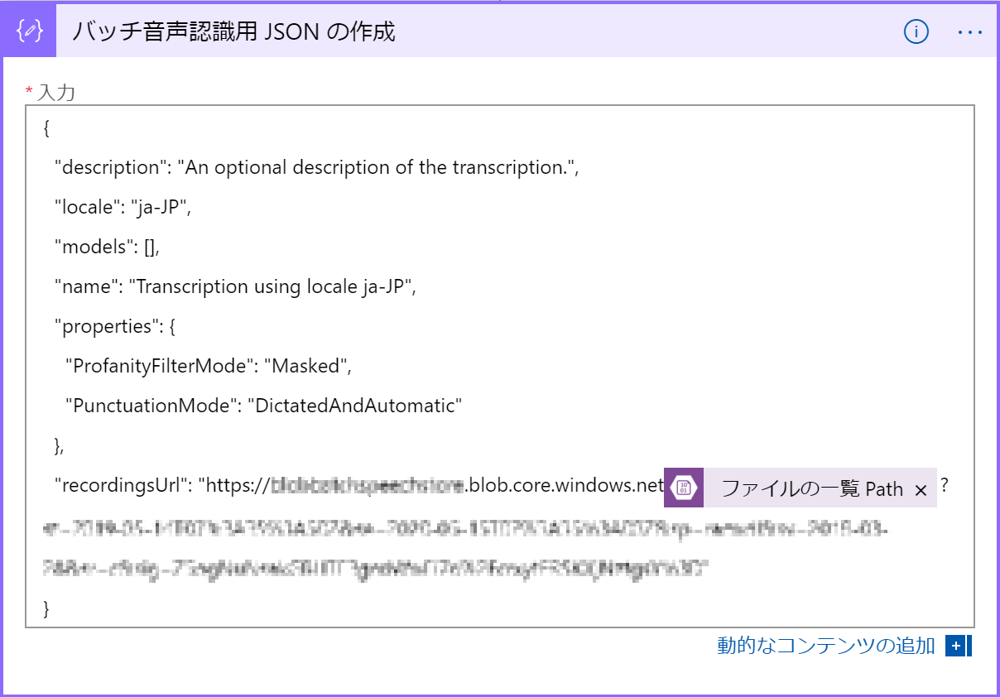

    カスタムモデルのIDは、現行 Custom Speech ポータルの場合は以下の画面で四角で囲まれたIDをご利用ください。

    [cris.ai](https://japaneast.cris.ai/Home/CustomSpeech)
     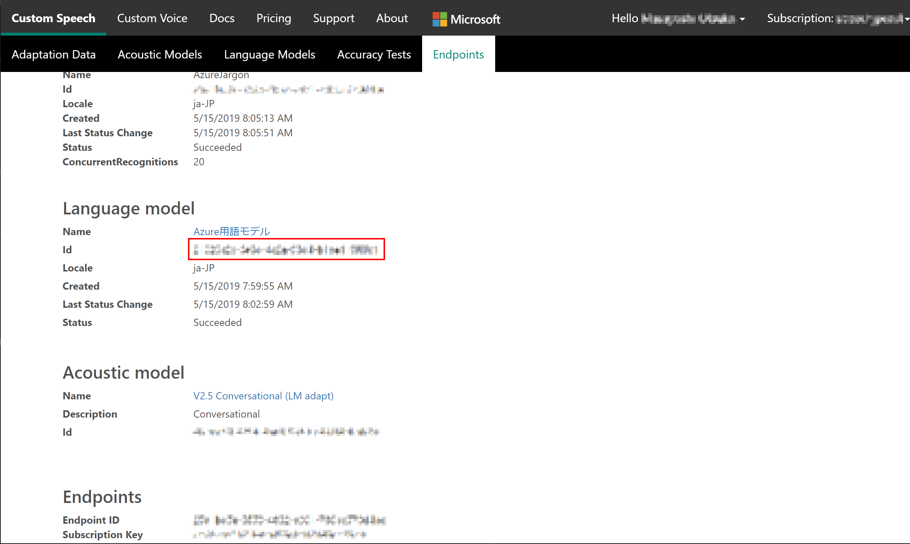

    新ポータルをご利用の場合には、以下の画面で四角で囲まれたIDをご利用ください。
    
    [speech.microsoft.com](https://speech.microsoft.com/)
     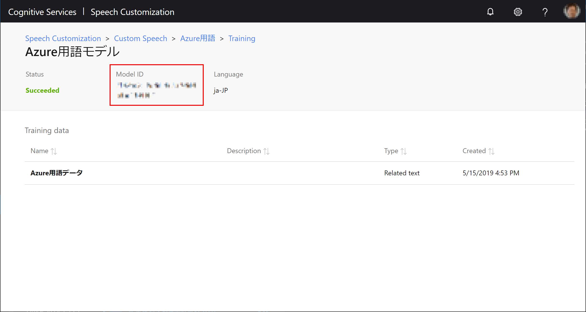

10. 結果のテキストファイルを配置する BLOB のフォルダを指定します。
     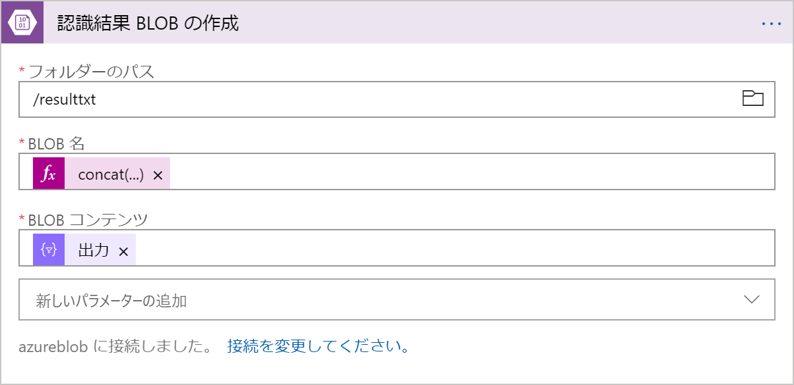

11. 最後に「保存」、「実行」ボタンを押し、トリガーを実行します（この時点では何も動きません）。
 
12. 10項で指定した BLOB コンテナに音声ファイルを配置します。ここでは例として Azure Portal を使用してファイルを配置していますが、Web アプリケーションや Storage Explorer で配置しても問題ありません。
     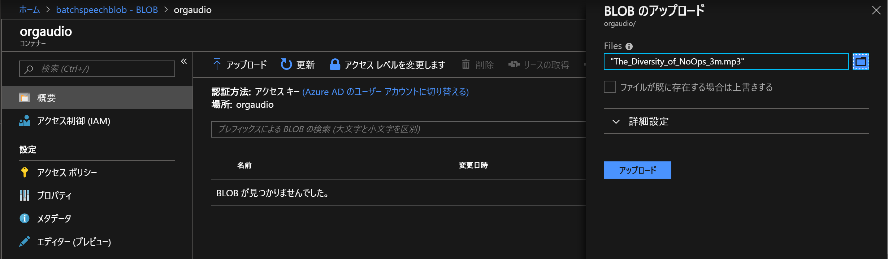

13. Logic Apps の「概要」をクリックし、「実行の履歴」に音声認識処理が追加されるのを待ちます（Event Grid トリガーを使用している場合には即時実行されます）。
     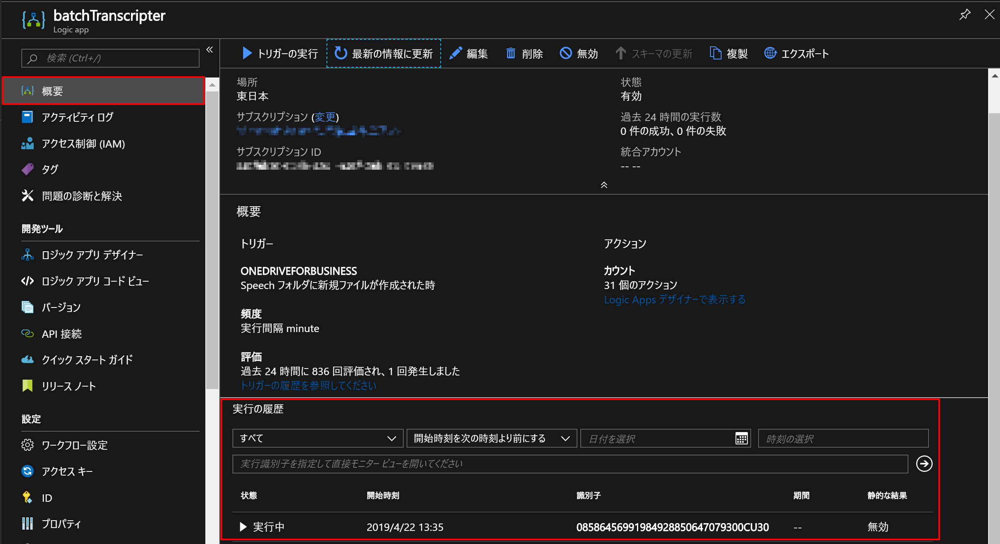

14. 追加された処理をクリックすると、現在の実行状況が表示されます。最後の処理が完了するまで待機します。
     

15. 全ての処理が完了後、元の音声ファイルが削除され、元のファイル名+.txt ファイルの音声認識結果ファイルが作成されていれば完了です。
     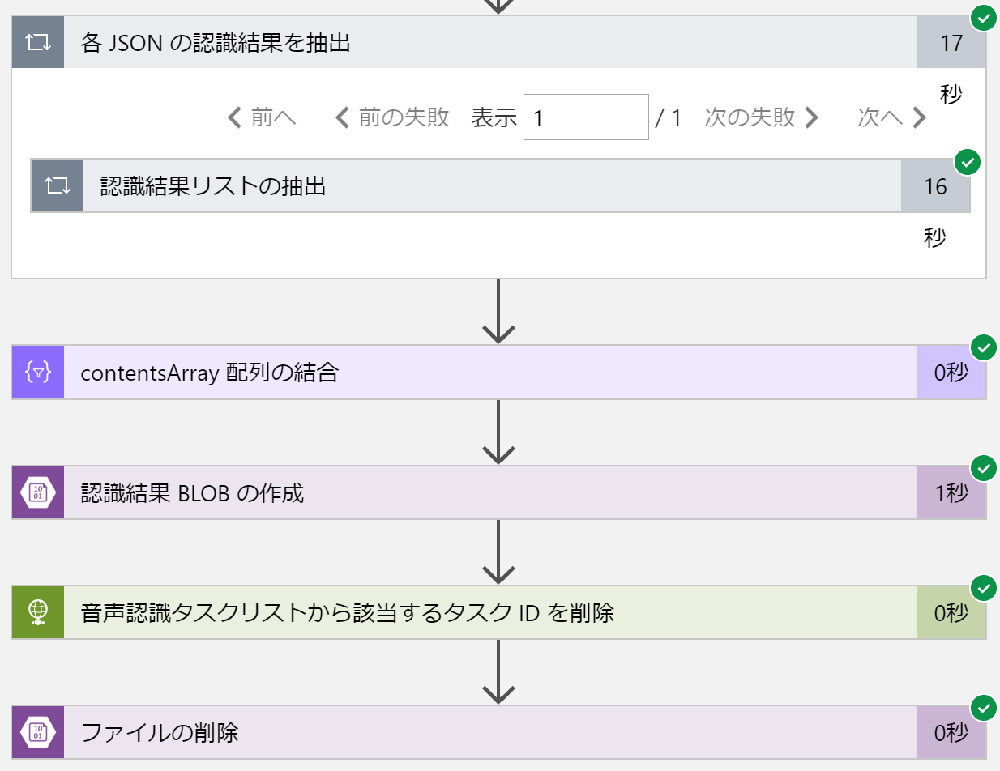

     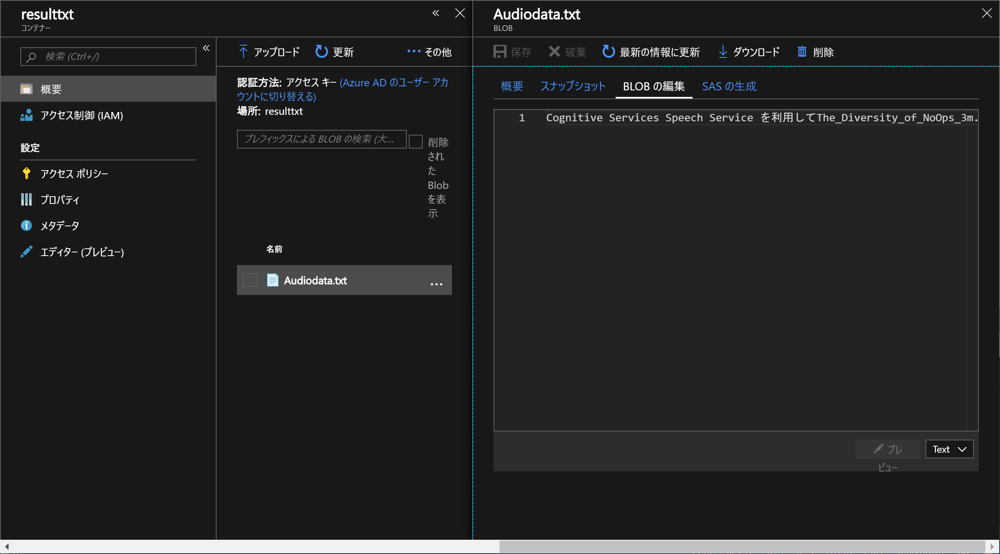
