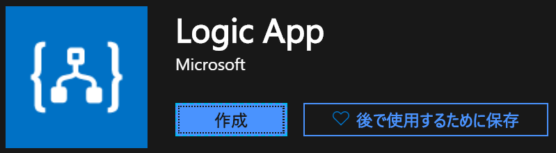
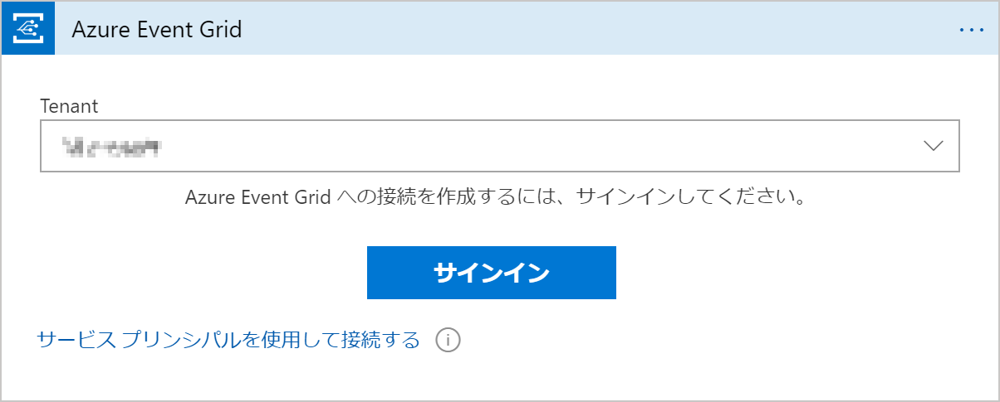
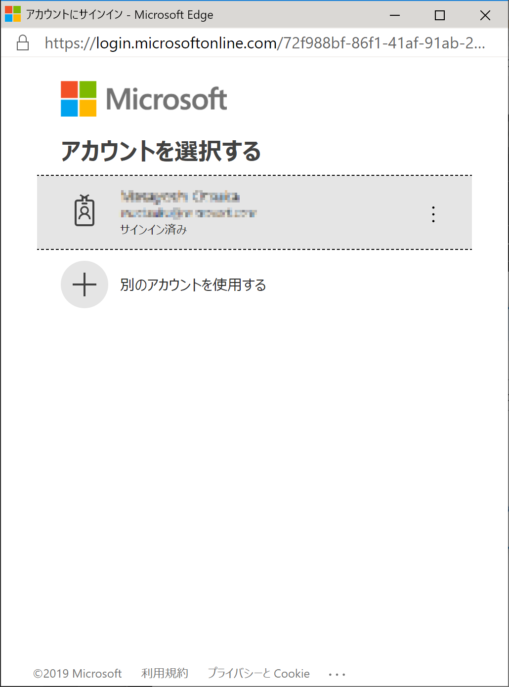

## 使い方（Azure Storage BLOB 版）

1. （BLOB が無い場合）事前準備として Azure Portal から Azure Storage Account を作成し、音声ファイルを格納する BLOB コンテナを作成します。コンテナの作成までの流れは、以下の URL が参考になります。
   
   [Windows Azure ストレージ オブジェクトを作成します](https://docs.microsoft.com/ja-jp/sql/tutorials/lesson-1-create-windows-azure-storage-objects?view=sql-server-2014)

2. （BLOB が無い場合）同じ方法で「認識結果ファイルを格納する」コンテナを作成します。

3. Azure Portal から Logic Apps を作成します。
   
    
    
   

4. デプロイされた Logic Apps リソースを開き、「空のロジック アプリ」を作成します。
   
    
   

5. 「ロジック アプリ デザイナー」が開くので「コネクタとトリガーを検索する」欄で「Azure Event Grid」と入力し、検索結果から「Azure Event Grid」を選択します。
    

6. トリガーの検索結果から「When a resource event occurs (プレビュー)」を選択します（プレビュー版が不安な方は Blob トリガーをご利用頂いても問題ありません。このトリガーはリアルタイムに検出可能であるのに対して、BLOB トリガーは一定時間間隔で検出可能となります）。
    

7. 初めて Event Grid 接続を行う場合には、以下のような画面が表示されることがあります。適切なテナント名を選択し、「サインイン」をクリックします。
    

8. サインイン画面がポップアップされるので、適切なアカウントでサインインします。
    

9.  下記のような画面が表示されるので「Allow access」をクリックします。
    

10. これで Event Grid トリガーが作成されるため、名前を「Speech BLOBフォルダに新規ファイルが作成された時」にし、「Subscription」の項目で適切な Azure サブスクリプションを選択し、「Resource Type」から「Microsoft.Storage.StorageAccount」を選択します。「Rsource Name」で利用する Azure Storage Account の名称を選択し、「Event Type 項目 - 1」は「Microsoft.Storage.BlobCreated」を選択します。「Prefix Filter」では Event Grid で認識可能な呼び出し名の「プレフィックス」を設定しますが、例えば「/blobServices/default/containers/<音声格納コンテナ名>/blobs/」を選択します。この部分が選択されていない場合、同じ Storage Account の異なる Blob にオブジェクトが作成される度にトリガーが発行されるため、ご注意ください。
    
    
11. 続けて Blob への接続情報を作成するために、一時的に後続のステップを追加します。トリガーの下部にある「＋新しいステップ」をクリックします。
    

12. 今回は接続情報を作成するために一時作成するので、「コネクタとアクションを検索する」欄に「Blob」と入力します。検索が完了すると画面下部の「アクション」欄に結果が表示されるため、「BLOB の一覧表示」を選択します。
    

13. 接続する BLOB の選択画面が表示されますので、接続したい BLOB を選択し、「作成」をクリックします。「接続名」は任意なのですが、後続作業でペーストするコードでの記述が「azureblob」となっているので、ここではそのように名前を付けます。他の名前に変更する場合には、後続の作業で適宜変更を行ってください。
    

14. 移行の作業に必要になる接続情報を取得するために、「コードビュー」をクリックします。
    

15. 先ほど作成した接続情報（ここでは azueblob）の接続情報をコピーし、メモ帳等で保管します。
    

16. これで接続設定の作成と保管が完了しました。このアクションはもう必要ありませんので、「デザイナー」ボタンでデザイン画面に戻り、ボックス右上の「・・・」をクリックし、「削除」をクリックしてアクションを削除します。
    

17. 「保存」をクリックし、一旦内容を保存した後、「コードビュー」をクリックします。
    

18. 開いたコードの `definition` とサブアイテムの `$schema`から `parameters` までの内容を選択し、BatchTranscriptforBlob.json のファイルの内容で全て上書きコピーします（triggers は消さないように注意してください）。コピー完了後、先ほど保存した接続情報を ` $connections` のサブアイテムの `values` に追加します。
    

19. 変更後、「保存」をクリックします。その後「デザイナー」ボタンをクリックし、デザイナー画面を開きます。
    

20. 次に「バッチ音声認識要求を POST する」を開き、「Ocp-Apim-Subscription-Key」の右のカラムに Speech Services のサブスクリプション キーを入力します（サービス未作成の場合は別途作成してください）。このシステムでは REST の呼び出し先が「japaneast（東日本）」となっていますので、東日本でサービスを作成するか、適宜変更を行ってください。
    

21. 以下のアクションについても同様に変更を行います。
     
     
     
     

22. 結果のテキストファイルを配置する BLOB のフォルダを指定します。
     

23. 最後に「実行」ボタンを押し、トリガーを実行します（この時点では何も動きません）。
    
24. 10項で指定した BLOB コンテナに音声ファイルを配置します。ここでは例として Azure Portal を使用してファイルを配置していますが、Web アプリケーションや Storage Explorer で配置しても問題ありません。
     

25. Logic Apps の「概要」をクリックし、「実行の履歴」に音声認識処理が追加されるのを待ちます（Event Grid トリガーを使用している場合には即時実行されます）。
     

26. 追加された処理をクリックすると、現在の実行状況が表示されます。最後の処理が完了するまで待機します。
     

27. 全ての処理が完了後、元の音声ファイルが削除され、元のファイル名+.txt ファイルの音声認識結果ファイルが作成されていれば完了です。
     

     
