## 使い方（OneDrive for Business 版）

1. Azure Portal から Logic Apps を作成します。
   
    
    
   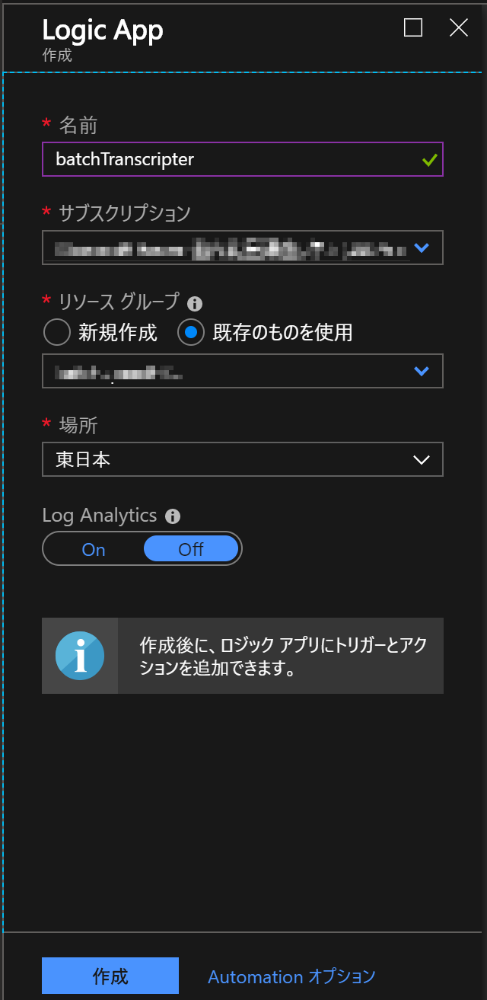

2. デプロイされた Logic Apps リソースを開き、「空のロジック アプリ」を作成します。
   
   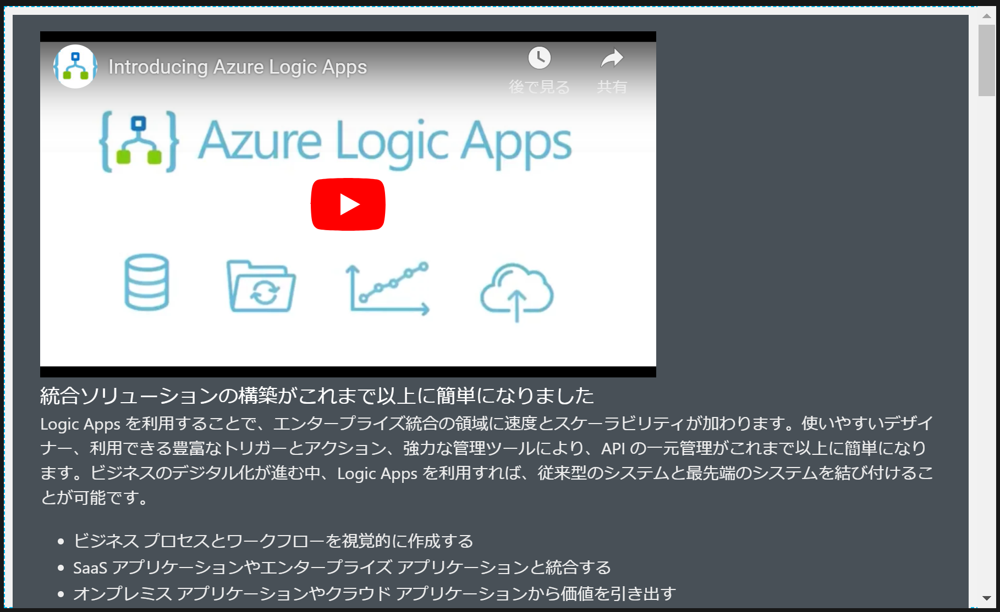 
   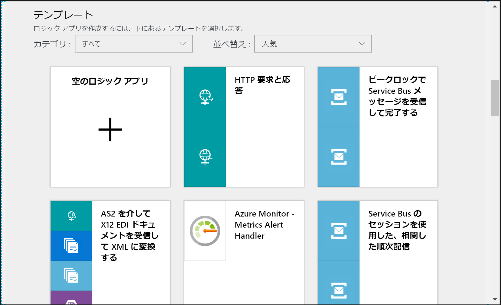

3. 「ロジック アプリ デザイナー」が開くので「コネクタとトリガーを検索する」欄で「OneDrive for Business」と入力し、検索結果から「OneDrive for Business」を選択します。
    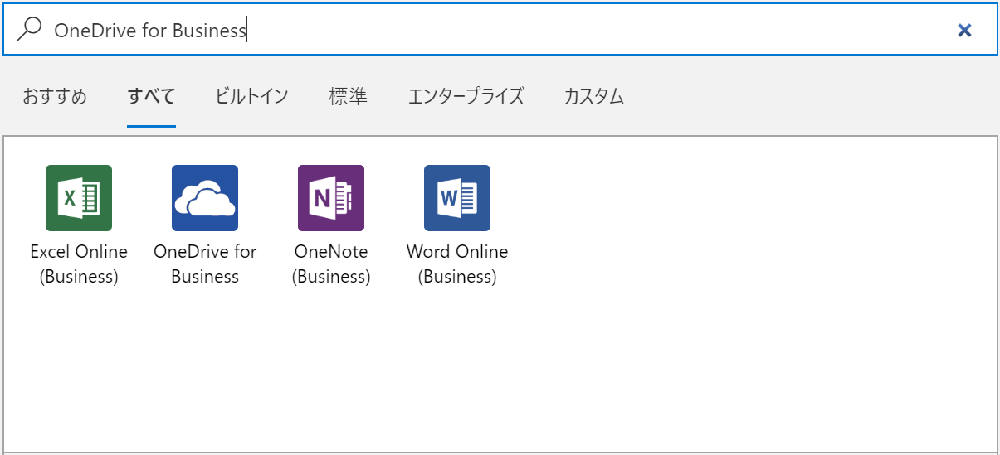

4. トリガーの検索結果から「ファイルが作成されたとき」を選択します（プレビュー版はサブディレクトリの再帰検索が可能です）。
    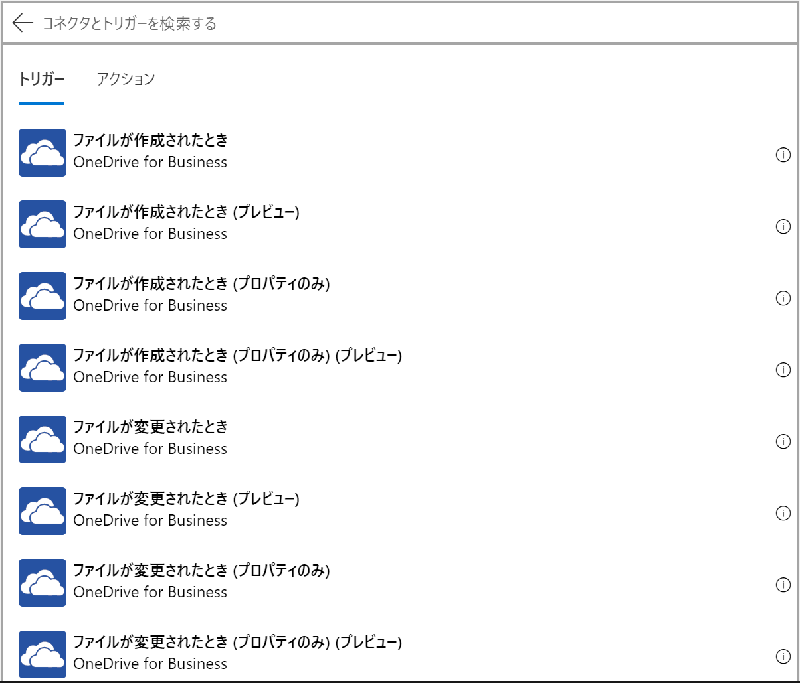

5. API接続情報は自動的に作成されないため、以下の画面で「サインイン」をクリックし、API 接続を作成します。
    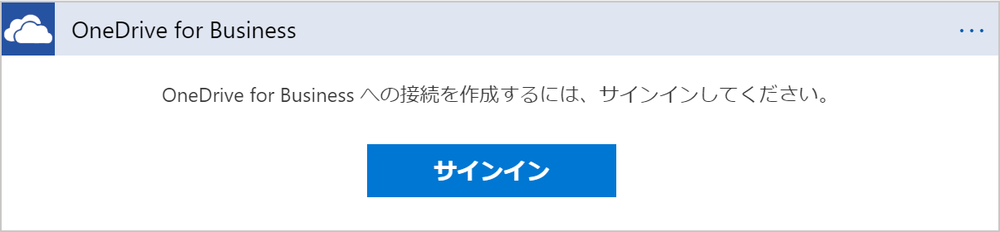

6. 認証画面がポップアップ表示されるので、必要なユーザーで認証を行います。
    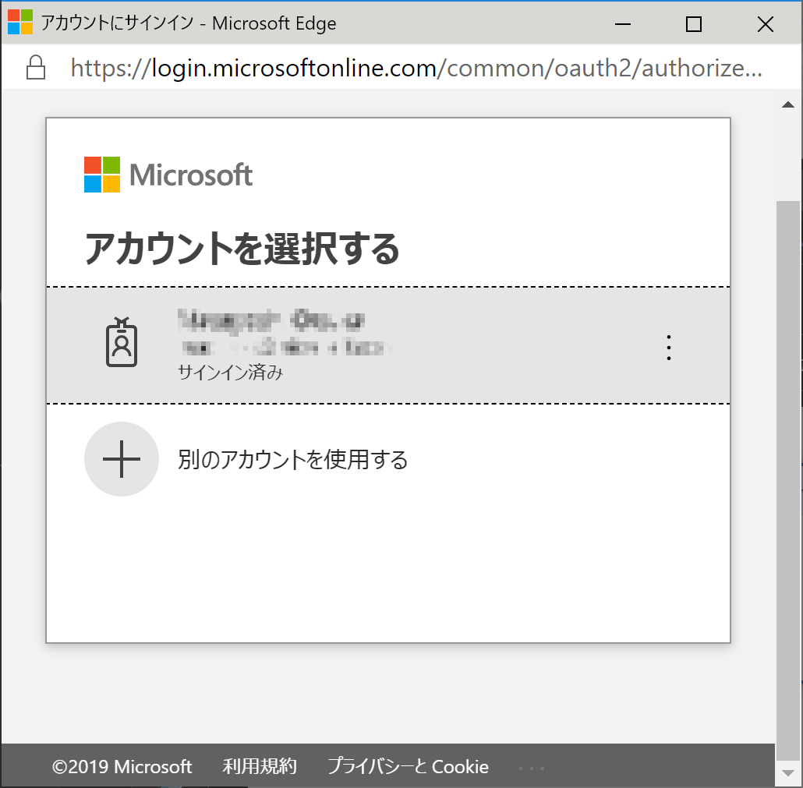

7. 更に OneDrive for Business での認証を許可します。
    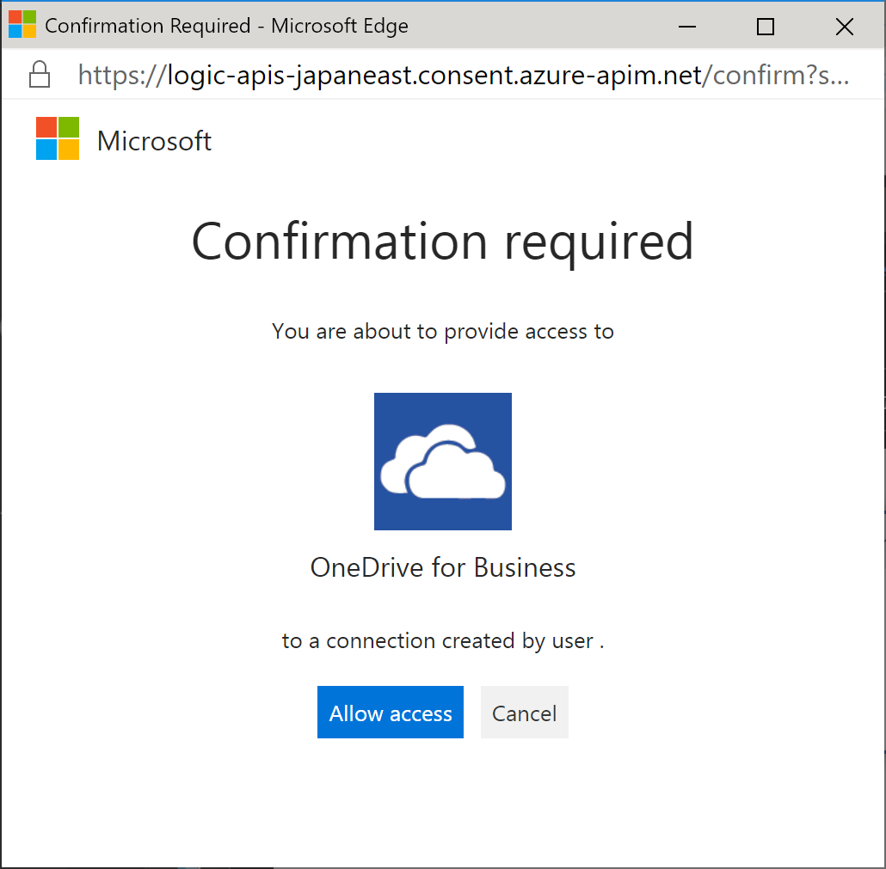

8. トリガーが作成されるため、名前を「Speech フォルダに新規ファイルが作成された時」にし、OneDrive for Business のフォルダから文字起こしをしたいフォルダを指定します。「間隔」は実際にチェックを行いたい時間の間隔を指定します。
    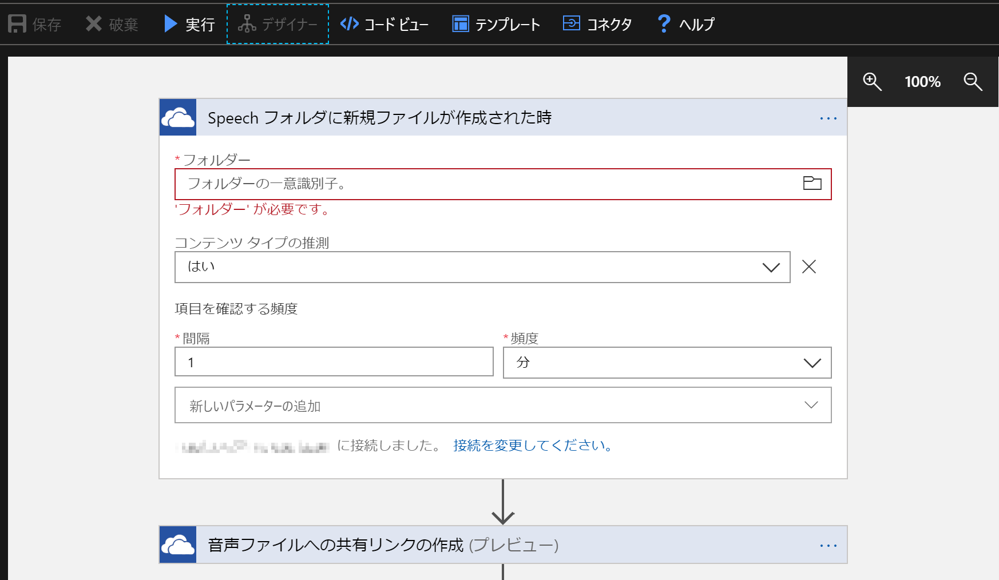

9. 「保存」をクリックし、一旦内容を保存した後、「コードビュー」をクリックします。
    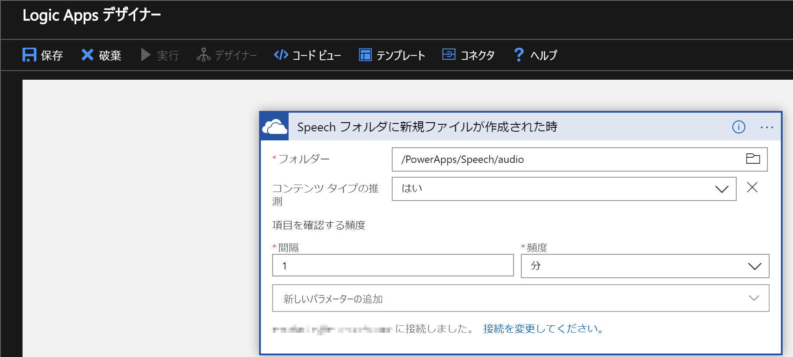

10. 開いたコードの「definition」とサブアイテムの「$schema」から「parameters」の内容を選択し、BatchTranscriptforOneDriveBiz.json のファイルの内容で全て上書きコピーします（triggers は消さないように注意してください）。
    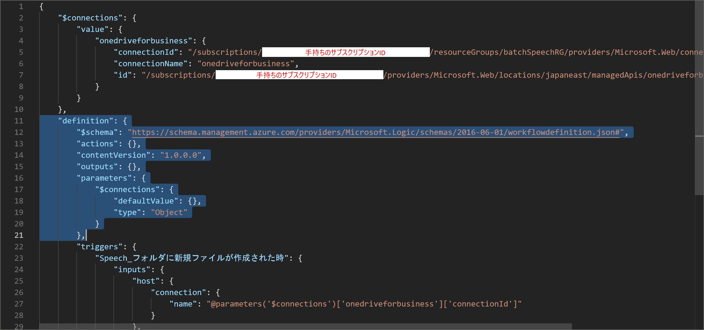

11. 変更後、「保存」をクリックします。その後「デザイナー」ボタンをクリックし、デザイナー画面を開きます。
    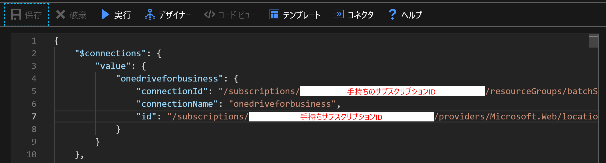

12. 次に「バッチ音声認識要求を POST する」を開き、「Ocp-Apim-Subscription-Key」の右のカラムに Speech Services のサブスクリプション キーを入力します（サービス未作成の場合は別途作成してください）。このシステムでは REST の呼び出し先が「japaneast（東日本）」となっていますので、東日本でサービスを作成するか、適宜変更を行ってください。
    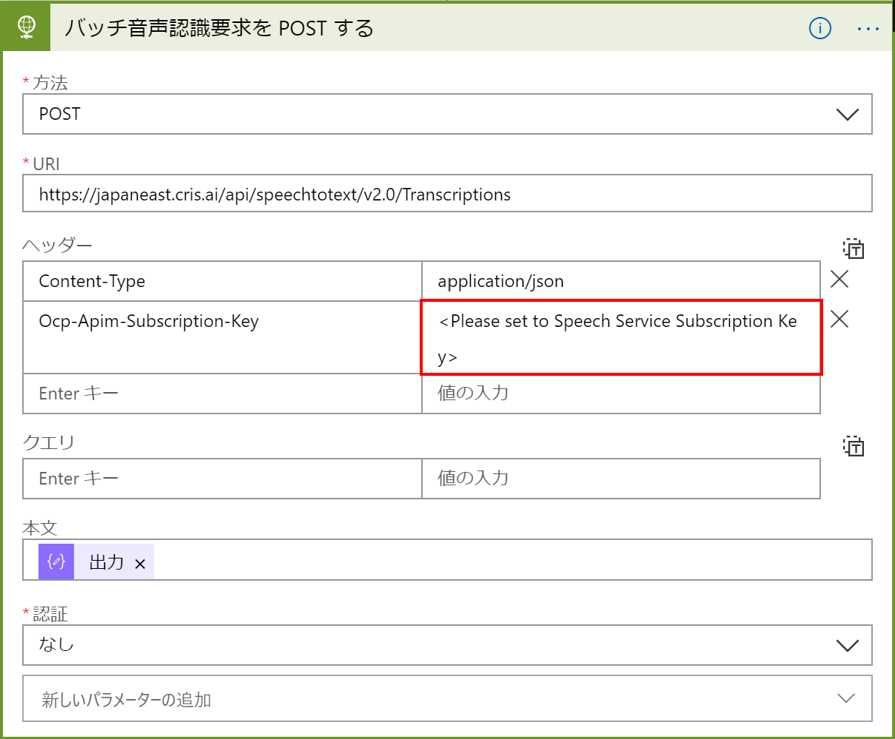

13. 以下のアクションについても同様に変更を行います。
     
     
     
     

14. 結果のテキストファイルを配置する OneDrive for Business のフォルダを指定します。
     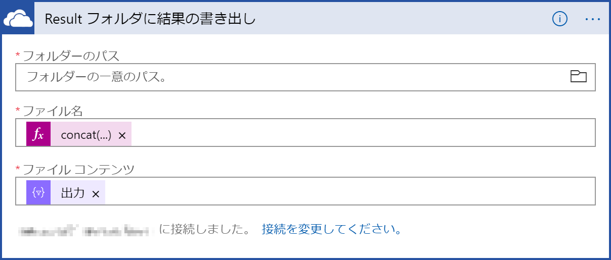

15. 最後に「実行」ボタンを押し、トリガーを実行します（この時点では何も動きません）。
    
16. 8項で指定した OneDrive for Business フォルダに音声ファイルを配置します。ここでは例として Explorer に統合された OneDrive にファイルを配置していますが、Web で直接置いても問題ありません。
     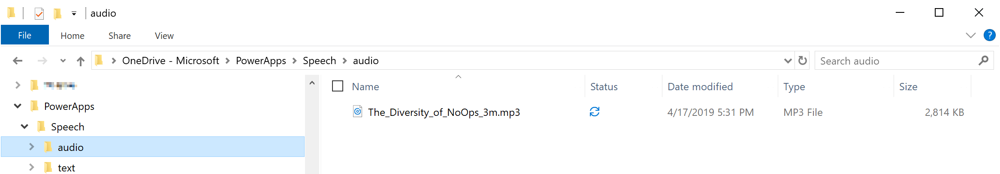

17. Logic Apps の「概要」をクリックし、「実行の履歴」に音声認識処理が追加されるのを待ちます（ローカルのOneDrive for Business のフォルダに配置した場合、処理開始まで数分掛かることがあります）。
     

18. 追加された処理をクリックすると、現在の実行状況が表示されます。最後の処理が完了するまで待機します。
     

19. 全ての処理が完了後、元の音声ファイルが削除され、元のファイル名+.txt ファイルの音声認識結果ファイルが作成されていれば完了です。
     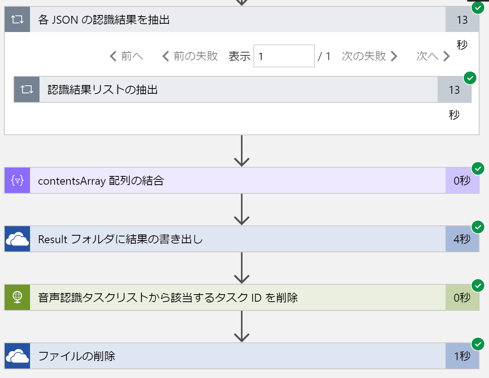

     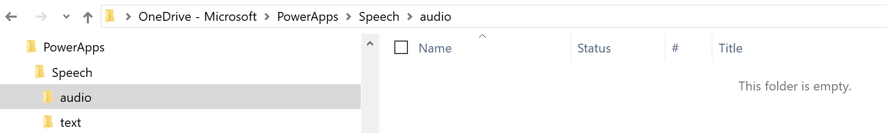
    
     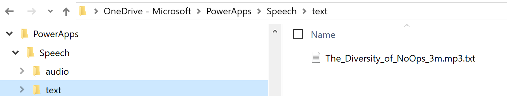
